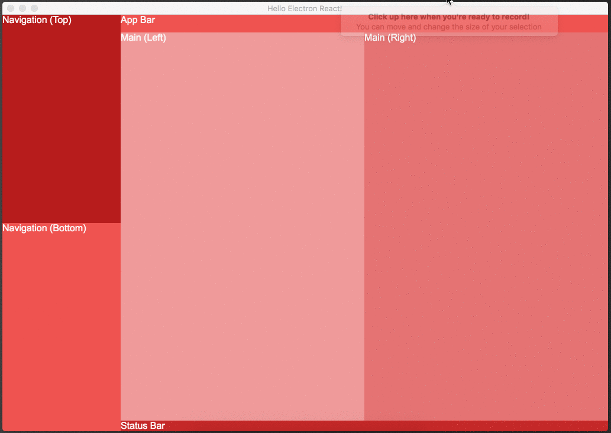

# Common Electron App Layout (with React)

*Note: this repo is meant to show guidance on how to structure the UI in an Electron/React app with a common approach.  Use it as a guide to quickly get a UI together for you to modify to your app*

## What does it look like?

## What should you do with this?

Make it your own! :boom: Use this as a guide to structure the UI for you Electron/React app.

## Credit

This app was created from a clone of the amazing [electron-react-boilerplate](https://github.com/chentsulin/electron-react-boilerplate) repo.  So many thanks to [chentsulin](https://github.com/chentsulin) for creating and maintaining this wonderful boilerplate!
